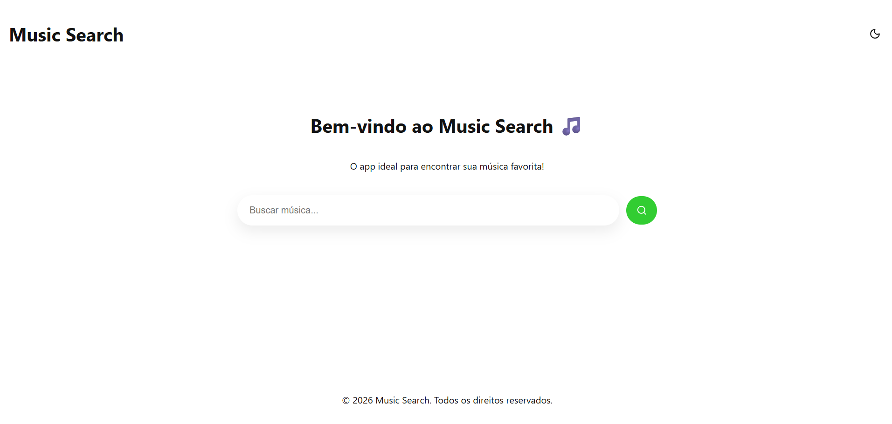
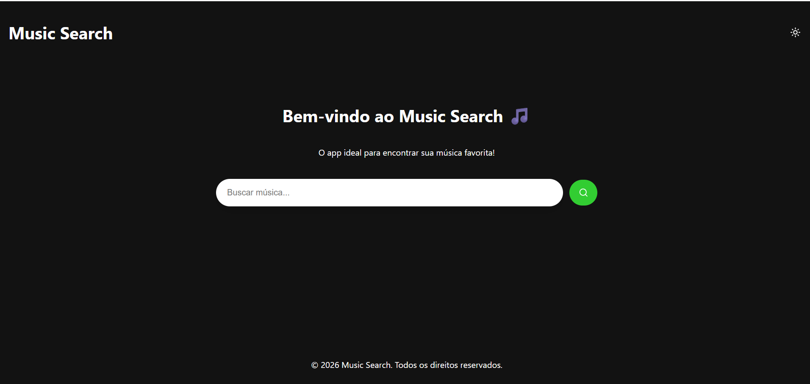
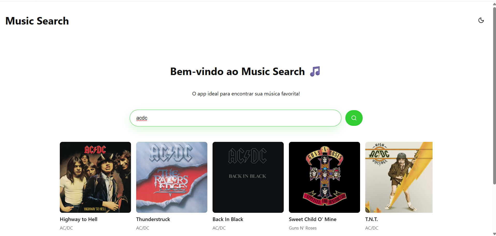
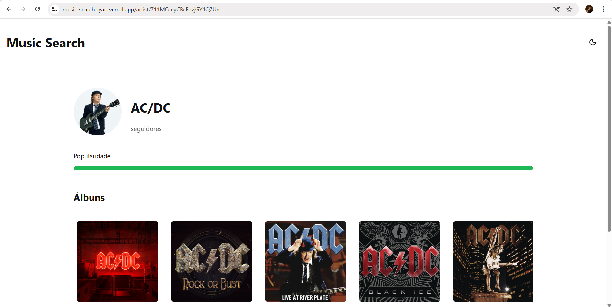

# 🎵 Music Search

A web application for searching songs and exploring artist profiles using the Spotify Web API. Users can search for any track, browse results in a horizontal carousel, and navigate to a dedicated artist page displaying their biography, follower count, popularity rating, and full discography.

---

## 🖼️ Screenshots

### Home — Track Search


### Artist Profile


---

## 🌐 Online Application

> 🔗 **Live Demo:** [https://your-deployment-url.vercel.app](https://your-deployment-url.vercel.app)

---

## 🛠️ Technologies Used

| Technology | Version | Purpose |
|---|---|---|
| [React](https://react.dev/) | 19.x | UI component library |
| [TypeScript](https://www.typescriptlang.org/) | 5.9.x | Static typing |
| [Vite](https://vitejs.dev/) | 8.x | Build tool and dev server |
| [React Router DOM](https://reactrouter.com/) | 7.x | Client-side routing |
| [Lucide React](https://lucide.dev/) | 1.8.x | Icon library (Search, Moon, Sun) |
| [Spotify Web API](https://developer.spotify.com/documentation/web-api) | — | Music data (tracks, artists, albums) |
| CSS Modules | — | Scoped component-level styling |

---

## ⚙️ Installation and Execution

### Prerequisites

- **Node.js** 18 or higher
- **npm** 9 or higher
- A [Spotify Developer](https://developer.spotify.com/dashboard) account

### 1. Clone the repository

```bash
git clone https://github.com/your-username/music-search.git
cd music-search
```

### 2. Install dependencies

```bash
npm install
```

### 3. Configure environment variables

Create a `.env` file in the project root:

```bash
cp .env.example .env
```

Fill in your Spotify credentials:

```env
VITE_SPOTIFY_CLIENT_ID=your_client_id_here
VITE_SPOTIFY_CLIENT_SECRET=your_client_secret_here
```

> To obtain these credentials: access the [Spotify Developer Dashboard](https://developer.spotify.com/dashboard), create a new app, and copy the **Client ID** and **Client Secret**.

### 4. Start the development server

```bash
npm run dev
```

The application will be available at **http://localhost:5173**

### 5. Build for production

```bash
npm run build
npm run preview  # preview the production build at http://localhost:4173
```

---

## 📁 Project Structure

```
music-search/
├── public/                     # Static public assets
├── screenshots/                # Application screenshots for documentation
├── src/
│   ├── assets/                 # Images and static resources (hero.png, icons)
│   ├── components/             # Reusable UI components
│   │   ├── AlbumCard.tsx           # Card displaying album cover, name and release date
│   │   ├── AlbumCard.module.css
│   │   ├── MusicCard.tsx           # Card displaying track cover, name and artist
│   │   ├── MusicCard.module.css
│   │   ├── SearchBar.tsx           # Controlled search input with submit handler
│   │   ├── SearchBar.css
│   │   ├── Header.tsx              # App header with dark/light theme toggle
│   │   ├── Header.css
│   │   ├── Footer.tsx              # App footer
│   │   └── Footer.css
│   ├── config/
│   │   └── api.ts                  # API base configuration constants
│   ├── pages/
│   │   ├── Home/
│   │   │   ├── Home.tsx            # Home page: search bar + track carousel
│   │   │   └── style.module.css
│   │   └── Artists/
│   │       ├── Artist.tsx          # Artist page: profile, popularity bar, album carousel
│   │       └── styles.module.css
│   ├── services/
│   │   └── spotifyService.ts       # All Spotify API calls: auth token, search, artist, albums
│   ├── types/
│   │   ├── Track.ts                # Track interface
│   │   ├── Artists.ts              # Artist interface
│   │   ├── Album.ts                # Album interface
│   │   └── Profile.ts              # Profile interface
│   ├── App.tsx                     # Route definitions and theme state
│   ├── App.css                     # Global app styles and CSS theme variables
│   ├── index.css                   # CSS reset and base styles
│   └── main.tsx                    # Application entry point
├── .env                        # Environment variables (not committed)
├── .env.example                # Environment variable template
├── index.html                  # HTML entry point
├── package.json
├── tsconfig.app.json
├── tsconfig.node.json
└── vite.config.ts
```

---

## 🏗️ Application Architecture

The application follows a **unidirectional data flow** pattern with a clear separation between data fetching, state management, and UI rendering.

### Architecture Diagram

```
┌─────────────────────────────────────────────────────┐
│                     App.tsx                         │
│         (Router + Theme State + Layout)             │
│              ┌──────────┬──────────┐                │
│           Header      Main       Footer             │
│         (theme toggle) │                            │
└─────────────────────────┼───────────────────────────┘
                          │
          ┌───────────────┴────────────────┐
          │                                │
   ┌──────▼──────┐                 ┌───────▼──────┐
   │  Home Page  │                 │ Artist Page  │
   │             │                 │              │
   │ SearchBar   │                 │ Artist Info  │
   │     ↓       │                 │ Popularity   │
   │  Carousel   │                 │  Carousel    │
   │  MusicCard  │                 │  AlbumCard   │
   └──────┬──────┘                 └───────┬──────┘
          │                                │
          └──────────────┬─────────────────┘
                         │
              ┌──────────▼──────────┐
              │  spotifyService.ts  │
              │                     │
              │  getAccessToken()   │
              │  searchTracks()     │
              │  getArtist()        │
              │  getArtistAlbums()  │
              └──────────┬──────────┘
                         │
              ┌──────────▼──────────┐
              │   Spotify Web API   │
              │  (Client Credentials│
              │       Flow)         │
              └─────────────────────┘
```

### Key Architectural Decisions

- **Client Credentials Flow** — Authentication is handled entirely on the client using Spotify's machine-to-machine token flow. The token is cached in memory and automatically refreshed when expired, avoiding redundant requests.
- **Centralized service layer** — All API calls are isolated in `spotifyService.ts`. Components never call `fetch` directly, making the data layer easy to replace or extend.
- **CSS Modules** — Each component has its own scoped stylesheet, preventing class name collisions across the application.
- **Carousel without external libraries** — The horizontal carousel is implemented with `display: flex`, `overflow: hidden` on the viewport, and `transform: translateX` on the track, controlled by a `currentIndex` state in React.
- **Theme system** — Dark/light mode is implemented via a `data-theme` attribute on `<html>`, toggled from the Header and consumed by CSS custom properties defined in `App.css`.

---

## Prints





## 🔀 Version Control

This project was developed using **Git** for version control.

> 🔗 **Repository:** [https://github.com/your-username/music-search](https://github.com/your-username/music-search)

### Recommended branch strategy

```
main          → stable production code
dev           → active development
feature/*     → individual features (e.g., feature/album-carousel)
fix/*         → bug fixes
```

---

## 💡 Possible Improvements

- **Backend proxy** — Move Spotify token generation to a server (e.g., Node.js/Express or AWS Lambda) to avoid exposing the Client Secret in the browser bundle
- **Search debounce** — Delay API calls while the user is still typing to reduce unnecessary requests
- **Audio preview** — Embed the 30-second Spotify preview clip directly in the MusicCard
- **Favorites** — Allow users to save tracks and artists using `localStorage` or a backend
- **Pagination / infinite scroll** — Load more than 10 results per search
- **Loading skeletons** — Replace plain loading text with animated skeleton cards
- **Error boundaries** — Add React error boundaries for graceful UI fallback on API failures
- **Unit tests** — Add tests for the service layer and carousel navigation logic using Vitest

---

## 📄 License

This project was developed for academic purposes. Music data is provided by the [Spotify Web API](https://developer.spotify.com/) and is subject to their [Terms of Service](https://developer.spotify.com/terms).

> ⚠️ **Security notice:** Never commit your `.env` file. Ensure it is listed in `.gitignore` before pushing to a public repository.
